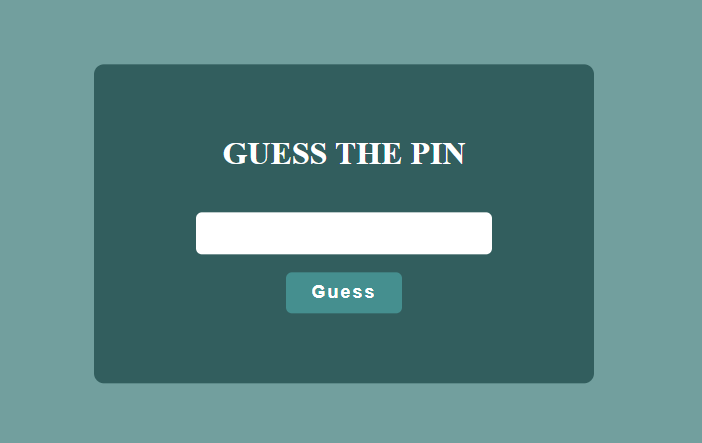
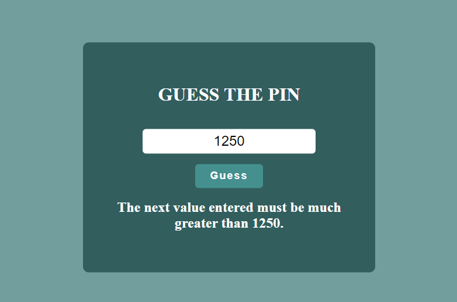

# Project: Guess the PIN Game

## Description
This is a project of a simple JavaScript game called "Guess the PIN". The objective of the game is to challenge users to guess a 4-digit PIN. As users enter their guesses, the website provides feedback indicating whether the correct PIN is greater than, less than, or equal to the current guess. The game continues until the user guesses the PIN correctly or decides to end the attempt.

## Features
- Simple and user-friendly interface.
- Random generation of a 4-digit PIN at the beginning of the game.
- Dynamic feedback indicating whether the guess is greater than, less than, or equal to the PIN.
- Attempt count so that the user can track their progress.

## Technologies Used
- HTML5: Page structure.
- CSS3: Styling for a pleasant visual experience.
- JavaScript: Game logic and interactivity.

## Project Structure
- `src/index.html`: Contains the structure of the web page.
- `src/style.css`: Style file to stylize the game's appearance.
- `src/index.js`: Game logic implemented in JavaScript.
- `README.md`: This document.

## How to Play
1. Clone this repository to your local machine.
2. Navigate to the project folder and open the index.html file in your browser.
3. A 4-digit PIN will be randomly generated.
4. Enter your 4-digit guess in the provided field.
5. Receive feedback on whether the PIN is greater than, less than, or equal to your guess.
6. Keep guessing until you correctly guess the PIN.

## Prerequisites
Make sure you have a modern web browser that supports HTML5, CSS3, and JavaScript.

## Contributions
Contributions are welcome! If you find bugs or have improvements to suggest, feel free to open an issue or submit a pull request.

Enjoy playing "Guess the PIN"!